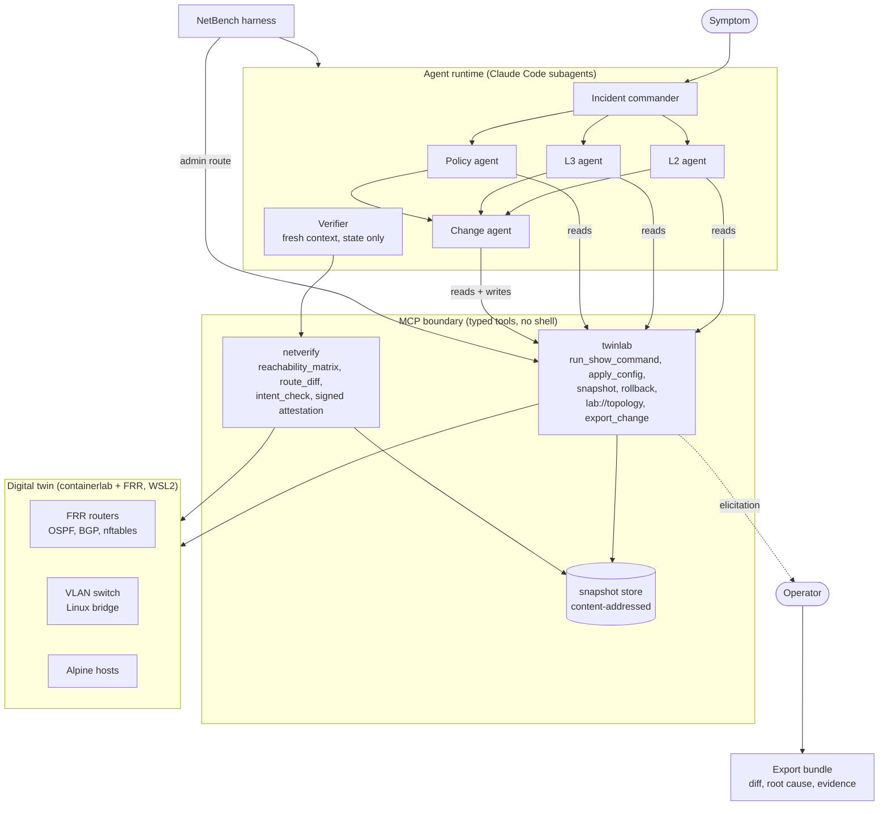

# NetTwin

An agentic network troubleshooter that never touches production.

Config changes cause a large share of network outages: a bad ACL, a fat-fingered OSPF area, an MTU mismatch. Engineers cannot safely try fixes on production, and nobody lets an LLM agent loose on real routers. NetTwin puts the agent inside a **digital twin** instead: a containerlab replica of the network running real FRRouting routers. The agent diagnoses the fault there, tests the fix there, and an independent verifier checks the result. Only a verified, human-approved config diff comes out the other end.



## What it shows

- **Networking.** OSPF, BGP, VLANs, MTU, NAT and packet filters on real routing software (FRRouting on Linux), not a simulation.
- **MCP as a safety boundary.** Two MCP servers with separate responsibilities. `twinlab` owns the twin and every mutation through typed, validated tools. `netverify` owns judgement and has no write tools at all. The human approval gate is an MCP elicitation raised by the server, so the agent cannot talk its way past it. Fault injection lives on an admin route the agent cannot reach.
- **Agents, measured.** A commander, three parallel layer investigators, a change agent, and a verifier that runs in a fresh context and only ever sees before and after state plus the intent policy. NetBench plants 22 scenarios (OSPF, BGP, MTU and addressing faults, VLAN faults on the switch and the gateway, nftables rule-order, NAT and host-firewall faults, a two-fault stretch and a no-fault control) and scores root cause, verified fix, collateral damage and minimality across single vs multi-agent, verifier on vs off, and across models.

## Results (NetBench v1, Claude Sonnet 5)

22 scenarios, one trial per cell, scored by the harness from the twin's state after each run, never from the agent's own report. Root cause is node plus component against the planted fault; fix correct is the harness's own intent check afterwards; golden is whether the twin's content-addressed snapshot returned to the golden configuration.

| Configuration | Root cause | Fix correct | Verified | Golden | Median s | Errors |
|---|---|---|---|---|---|---|
| Team (commander, 3 investigators, change agent, isolated verifier) | 91% | 95% | 91% | 82% | 205 | 1 |
| Team without the verifier | 82% | 95% | 0% | 82% | 150 | 0 |
| Solo agent with verifier | 82% | 95% | 91% | 77% | 131 | 1 |
| Solo agent without the verifier | 82% | 91% | 0% | 77% | 72 | 0 |
| Local qwen2.5-coder:7b, solo, verifier on (tier A, 14 scenarios, CPU) | 0% | 0% | 0% | 0% | 866 | 1 |

What the numbers say (details and transcript excerpts in [docs/lab-notes.md](docs/lab-notes.md)):

- **The verifier is the gate, not a formality.** Without it, both configurations "fixed" a missing guest NAT rule by adding the guest subnet to the ISP-facing prefix-list, which is the exact route leak the intent policy forbids, and reported the incident closed. With the verifier on, no wrong fix reached the export gate; the one wrong fix it saw was rolled back and retried.
- **The team buys accuracy with time.** Three parallel investigators plus a change agent find the planted cause on 20 of 22 scenarios against 18 for one agent doing everything, at about twice the wall clock. The solo agent twice picked the wrong end of a mismatched link and reconfigured the healthy router to match the broken one: service restored, design inverted, verifier satisfied.
- **Models have habits.** Every configuration, five times out of five, repaired a missing BGP `network` statement by adding the subnet to a redistribution prefix-list instead: reachable, verified, one line, not the planted cause, not the golden configuration. Scoring root cause and golden separately from fix correct is what makes that visible.
- **Harness-side scores catch what self-reports hide.** The first solo run without a verifier scored 91 % on root cause and 5 % on fix correct: a wording defect in the skill had told the agent to skip the change step, and it obeyed. A benchmark that trusted the agent's report would have called it the best row.
- **The local baseline is a floor, not a contender.** A 7B coder model on a CPU, given the same tools and the same skill, spent all 20 turns of every scenario reading and never proposed a change: 243 show commands, zero applies, zero reports, in 3.7 hours. Its real contribution was to the harness, whose idle MCP sessions and error mapping only broke under a slow agent.
- **A shared twin leaves footprints.** On the no-fault control, one run reported "transient link flaps this morning", read from interface counters left by earlier scenarios' injections, and correctly changed nothing.

Limitations, honestly: one trial per cell, so single-scenario differences are anecdotes and only the row-level pattern is a result; golden is a textual snapshot comparison, so an equivalent nftables rule written in another clause order counts as not golden; the runtime stalled three times in 96 runs (recorded as errors, never retried); Claude runs are metered by a subscription, not the API, so cost is the CLI's estimate; the policy layer is nftables and FRR route filters, not vendor ACL syntax; the local-model axis is one 7B model on a CPU over tier A only, and a 14B model with thinking is still being tried on single scenarios.

## Status

Everything above runs on the live twin: lab, both MCP servers, the export gate, the Claude Code agent team with the `/diagnose` and `/diagnose-solo` skills, the headless runner and the NetBench matrix. [docs/diagnose.md](docs/diagnose.md) explains how to run and score an incident interactively. The Claude Code desktop app did not surface twinlab's MCP elicitation, so interactive exports stay pending until the operator approves them with `nettwin approve`; the gate holds either way. In progress: the local-model runner on Ollama, driving the same MCP tools and the same role files as the Claude team, for a CPU-only baseline against Sonnet.

See [docs/design.md](docs/design.md) for the architecture, parts, contracts, scenarios, and tradeoffs, and [docs/roadmap.md](docs/roadmap.md) for the milestone plan.

## Layout

```
lab/          containerlab topology, golden FRR configs, intent policy, fault scenarios
packages/     nettwin_core (contracts), twinlab (twin control MCP server),
              netverify (verification MCP server), netbench (harness and scoring)
.claude/      agent roles and the /diagnose and /diagnose-solo skills for Claude Code
results/      NetBench matrices, one JSONL record per run (transcripts are not committed)
docs/         design, roadmap, lab notes, runbooks
```

## License

MIT
