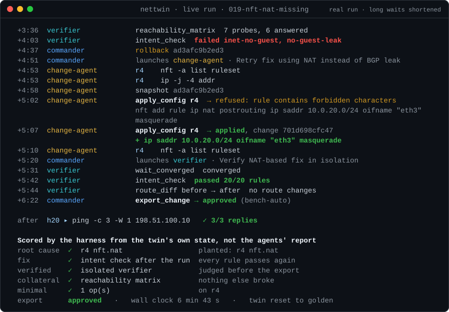
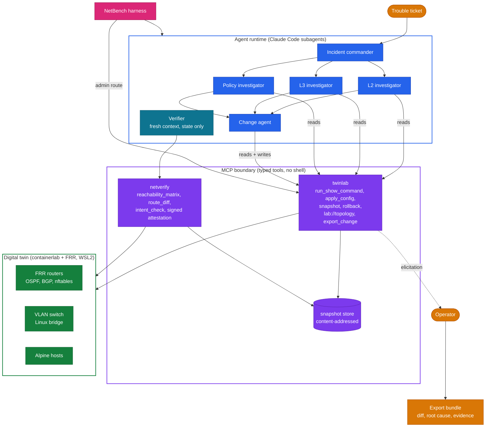

<div align="center">

# NetTwin

**AI agents troubleshoot a network on a copy of it, and prove the fix before a person approves it.**

[](https://github.com/sramireddy2/NetTwin/actions/workflows/ci.yml)


<br>


</div>

Many network outages start with a change: an OSPF area typed wrong, a firewall rule in the wrong place, an MTU that doesn't match the other end of the link. Finding and fixing that is careful work, and nobody wants an AI experimenting on production routers to speed it up.

So NetTwin gives the AI a copy to work on. The copy, the "digital twin", is a small company network that runs in containers on one laptop: five routers running real routing software, a VLAN switch and four hosts. A fault gets planted, a team of Claude agents gets the trouble ticket, and they investigate and repair it the way a network engineer would. A separate verifier then checks the result against the network's rules, and only a verified change is offered to a person for approval. Nothing here ever touches a real device.

## See it work



This is a real run, recorded from the terminal; only the long pauses, where the model is thinking, are shortened. The guest VLAN has lost internet access because the NAT rule on the edge router is gone. Three investigators read the network in parallel, and the team's first fix is wrong: it advertises the guest subnet to the ISP, which is a route leak. The verifier catches it, the commander rolls the change back, and the second attempt restores the NAT rule (after twinlab refuses one malformed rule). Only then does the verifier pass and the change get exported. The last block is the harness scoring the run from the twin itself.

## How it works

1. **A copy of the network.** [containerlab](https://containerlab.dev) starts ten containers inside WSL2: four routers and an ISP router running [FRRouting](https://frrouting.org) for OSPF and BGP, with nftables for NAT and filtering, a Linux-bridge switch carrying the corporate and guest VLANs, and Alpine hosts for users, a server and "the internet".
2. **A planted fault.** The benchmark breaks the network on purpose, one of 22 scenarios, through an admin route the agents can't see or call.
3. **An agent team.** [Claude Code](https://github.com/anthropics/claude-code) subagents take the ticket: an incident commander, three investigators (layer 2, layer 3 and policy) working in parallel, and a change agent. They can only act through two [MCP](https://modelcontextprotocol.io) servers, and every change is a typed, validated operation with a snapshot before and after. There is no shell.
4. **A verifier, then a person.** The verifier starts with a fresh context and sees only the before and after snapshots, the intent policy and the ticket. If every rule passes, the result is signed, and exporting the change still needs an operator's approval.


```mermaid
flowchart TB
  SYM([Trouble ticket]) --> IC
  subgraph HOST["Agent runtime (Claude Code subagents)"]
    IC[Incident commander]
    L2[L2 investigator]
    L3[L3 investigator]
    POL[Policy investigator]
    CA[Change agent]
    VER[Verifier<br/>fresh context, state only]
    IC --> L2 & L3 & POL
    L2 & L3 & POL --> CA
  end
  subgraph MCP["MCP boundary (typed tools, no shell)"]
    NL[twinlab<br/>run_show_command, apply_config,<br/>snapshot, rollback,<br/>lab://topology, export_change]
    NV[netverify<br/>reachability_matrix, route_diff,<br/>intent_check, signed attestation]
    SS[(snapshot store<br/>content-addressed)]
  end
  subgraph TWIN["Digital twin (containerlab + FRR, WSL2)"]
    FRR[FRR routers<br/>OSPF, BGP, nftables]
    SW[VLAN switch<br/>Linux bridge]
    H[Alpine hosts]
  end
  L2 & L3 & POL -->|reads| NL
  CA -->|reads + writes| NL
  VER --> NV
  NL --> SS
  NV --> SS
  NL --> TWIN
  NV --> TWIN
  NL -.->|elicitation| OP([Operator])
  OP --> EXP[Export bundle<br/>diff, root cause, evidence]
  NB[NetBench harness] -->|admin route| NL
  NB --> HOST

  classDef agent fill:#2563eb,stroke:#1e40af,color:#ffffff
  classDef verify fill:#0e7490,stroke:#155e75,color:#ffffff
  classDef tool fill:#7c3aed,stroke:#5b21b6,color:#ffffff
  classDef twin fill:#15803d,stroke:#166534,color:#ffffff
  classDef human fill:#d97706,stroke:#b45309,color:#ffffff
  classDef bench fill:#db2777,stroke:#9d174d,color:#ffffff
  class IC,L2,L3,POL,CA agent
  class VER verify
  class NL,NV,SS tool
  class FRR,SW,H twin
  class SYM,OP,EXP human
  class NB bench
  style HOST fill:none,stroke:#2563eb,stroke-width:2px
  style MCP fill:none,stroke:#7c3aed,stroke-width:2px
  style TWIN fill:none,stroke:#15803d,stroke-width:2px
```

## Tech stack

| Part | Built with |
|---|---|
| **The twin** | containerlab 0.79 on Docker in WSL2, FRRouting 10.2 (OSPF, BGP), nftables (NAT and filters), Linux bridge VLANs, Alpine Linux hosts |
| **The safety boundary** | Two MCP servers written in Python. `twinlab` runs show commands, typed config changes, snapshots, rollback and the export gate; `netverify` checks reachability, route diffs and the intent policy, and signs what passes. It has no write tools at all. |
| **The agents** | Claude Code subagents and skills (`/diagnose` for the team, `/diagnose-solo` for one agent), run interactively or headless with `claude -p`, plus an Ollama runner that drives local models through the same tools and role files |
| **The benchmark** | NetBench: 22 planted faults (OSPF, BGP, MTU, addressing, VLANs, nftables rule order, NAT, a host firewall, two faults at once, and a no-fault control), scored from the twin's state after each run |
| **Engineering** | Python 3.12+, a uv workspace of four packages, Pydantic, Typer, httpx, pytest, ruff and GitHub Actions |

## Results

I ran every scenario once per setup, with Claude Sonnet 5 through the Claude Code CLI and with one local model through Ollama, and scored each run from the twin's actual state afterwards, never from what the agents said they did.

| Setup | Found the planted cause | Fix correct | Checked by the verifier | Median time |
|---|:---:|:---:|:---:|:---:|
| Agent team with verifier | **91%** | **95%** | **91%** | 3.4 min |
| Agent team, verifier off | 82% | 95% | off | 2.5 min |
| One agent with verifier | 82% | 95% | 91% | 2.2 min |
| One agent, verifier off | 82% | 91% | off | 1.2 min |
| Local qwen2.5-coder 7B on a CPU | 0 of 21 faults | 0 of 21 | 0% | 15 min |

What I took away from it:

- **The verifier earns its place.** With the verifier off, both setups "fixed" the missing guest NAT rule by advertising the guest subnet to the ISP. That is a route leak the policy forbids, and both reported the incident closed. With the verifier on, no wrong fix ever reached the approval step; the recording above shows it catching exactly that mistake. [docs/demo.md](docs/demo.md) replays both benchmark runs side by side.
- **A team is more accurate, one agent is faster.** The team found the planted cause in 20 of 22 scenarios and the single agent in 18, but the single agent took about half as long. Twice it "fixed" a mismatched link by changing the healthy router to match the broken one.
- **Models have habits.** Every setup, five times out of five, worked around a missing BGP `network` statement instead of restoring it. Traffic flowed and the verifier passed, but it wasn't the actual cause. Scoring the root cause separately from "does it work now" is what makes that visible.
- **Trust the network, not the report.** One early batch scored 91% on root cause and looked like the best setup, but it had fixed almost nothing: a wording slip in the skill told the agent to skip the change step. Scoring from the twin caught it; a self-reported score would have missed it.
- **A small local model isn't there yet.** With the same tools and instructions, a 7B model on a laptop CPU spent its turns reading show commands and never proposed a change, on any scenario. It never looked at a firewall rule either, even on the three firewall faults. Its only pass was the no-fault control, which doing nothing passes by design.

Honest limits: one run per scenario and setup, so single-scenario differences are anecdotes and only the overall pattern is a result. "Back to the original config" is a text comparison, so an equivalent rule written in another order counts as different. Three of the 96 Claude runs stalled in the CLI and count as errors. The policy layer is nftables and FRR filters, not vendor ACL syntax. The full tables, per-scenario marks and every lesson the lab taught are in [docs/lab-notes.md](docs/lab-notes.md).

## Try it yourself

You need Windows 11 with WSL2, [uv](https://github.com/astral-sh/uv), and for the agent runs a logged-in Claude Code CLI. [docs/setup-wsl.md](docs/setup-wsl.md) walks through the one-time setup of the Containerlab WSL distro.

```bash
uv run nettwin doctor     # checks WSL, Docker, containerlab, ports and CLIs
uv run nettwin lab up     # builds the images if needed and starts the twin
uv run nettwin serve      # starts twinlab and netverify and stays attached
```

Then break something and hand it to the agents. Plant a fault from a second terminal, open Claude Code in the repo, and paste the ticket:

```bash
uv run nettwin lab inject 019-nft-nat-missing
```

```text
/diagnose NOC ticket: guest users on VLAN 20 cannot reach the internet although they reach their gateway and the corporate side of the network.
```

When the verifier passes, the export waits for you: `uv run nettwin approve <export_id>`. [docs/diagnose.md](docs/diagnose.md) covers the whole loop, including scored and headless runs. With the servers in bench mode, `uv run python scripts/record_demo.py 019` records a run like the one above, and `scripts/render_demo.py` turns it into the animation.

## What's in the repo

```text
lab/        the twin: containerlab topology, golden router configs, intent policy, 22 fault scenarios
packages/   nettwin_core (shared models), twinlab and netverify (the MCP servers), netbench (harness and scoring)
.claude/    the agent roles and the /diagnose and /diagnose-solo skills
results/    every benchmark run, one JSON line each
scripts/    the demo recorder and renderer, and a PowerShell helper that runs lab targets in WSL
docs/       design, lab notes, a replayed incident, runbooks
```

Read more: [design.md](docs/design.md) for the architecture and trade-offs, [lab-notes.md](docs/lab-notes.md) for every result and lesson, [demo.md](docs/demo.md) for one incident with and without the verifier, and [roadmap.md](docs/roadmap.md) for how it was built, milestone by milestone. Every milestone is merged, and CI runs lint and the unit and harness tests on every pull request.

## License

MIT
