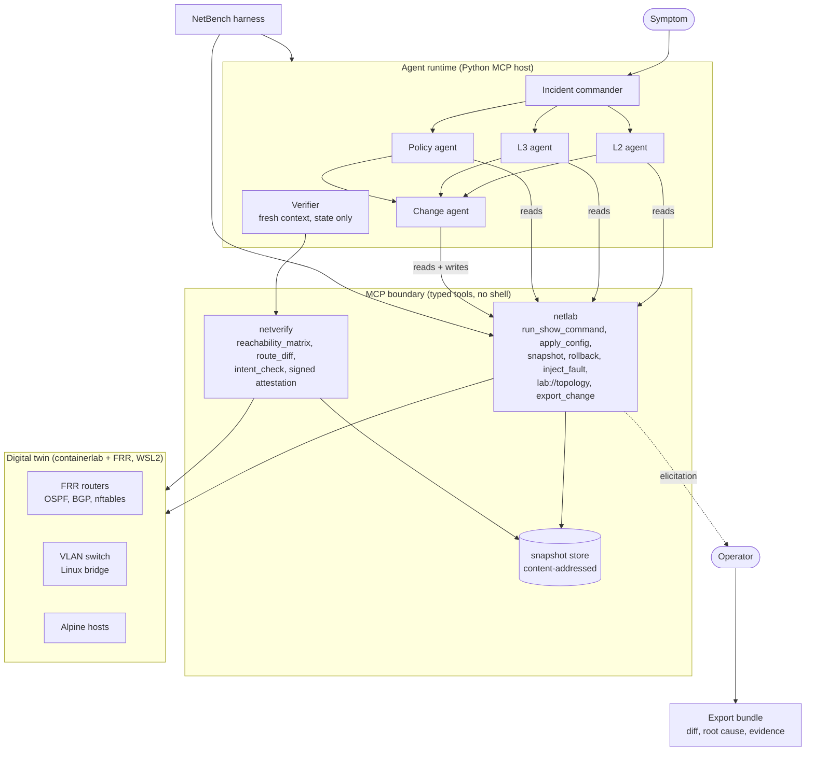
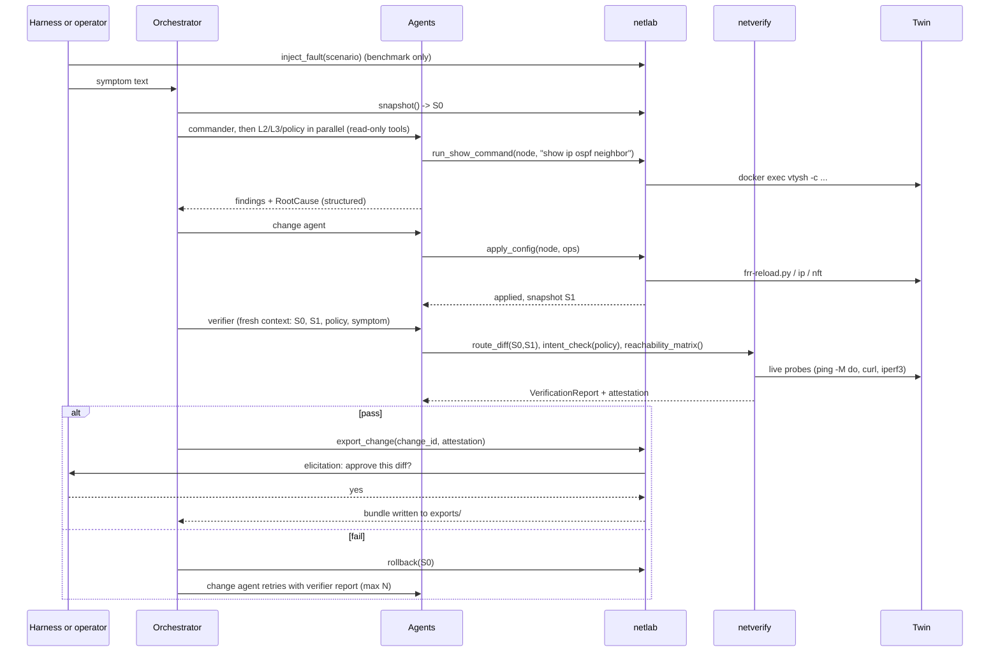

# NetTwin design

An agentic network troubleshooter that never touches production. Agents diagnose and fix faults inside a
containerlab + FRRouting replica of the network. An independent verifier checks the result against declared
intent. A human approves the exported diff through an MCP elicitation the agent cannot bypass. NetBench
measures how often the whole pipeline gets it right.

Date: 2026-09-19. Status: design only, nothing built yet.

## 1. Architecture



Three layers, one direction of trust:

- **Agents are untrusted.** They reason and call tools. They never get a shell, a docker socket, or a file path.
- **MCP servers are trusted code.** `netlab` owns the twin and every mutation. `netverify` owns judgement.
  Both validate inputs with pydantic and execute commands as argv lists via `docker exec`, never through a shell.
- **The twin is disposable.** Roll back to golden or redeploy at will.

The verifier and `netverify` form an independent path. The verifier's only tools are `netverify`'s. `netverify`
computes everything from live container state or from snapshots whose IDs are content hashes written by
`netlab`, so an agent cannot hand it a flattering "before" and "after".

### One incident, end to end



## 2. Parts

Each part has a clear owner, interface, and "done when". Build them in this order.

### Part 0. Lab environment

Owns: the reference topology, golden configs, container image, lab lifecycle.

- WSL2 distro with a native Docker engine and containerlab. Docker Desktop is not enough (see risks).
- Custom image `nettwin/frr` = `quay.io/frrouting/frr` + `iproute2`, `nftables`, `iperf3`, `tcpdump`, `curl`.
  Stock FRR images lack the data-plane tools.
- One reference topology (about 10 containers) that every scenario runs on:

  | Node | Role | Protocols |
  |---|---|---|
  | r1, r2 | core | OSPF area 0, iBGP, srv subnet on r2 |
  | r3 | distribution | OSPF area 1, 802.1Q subinterfaces for VLAN 10/20 |
  | r4 | edge | OSPF area 0, eBGP to isp, NAT (nftables) |
  | isp | upstream | eBGP, routes to `inet` |
  | sw1 | VLAN switch | Linux bridge, `vlan_filtering 1`, trunk to r3 |
  | h10, h20, srv, inet | hosts | Alpine, VLAN 10 / VLAN 20 guest / server / internet |

- Fast OSPF timers in golden config (hello 1s, dead 3s, SPF throttle low). Default timers make every
  benchmark run wait 40s per adjacency and produce flaky results.
- `make up`, `make down`, `make golden` (re-apply golden config + kernel state), `make check` (all hosts reach
  what they should).

Done when: `make up && make check` passes from cold in under two minutes.

### Part 1. `netlab` MCP server

Owns: every read and every write to the twin. Streamable HTTP transport, one process owns the lab.

Tools:

- `run_show_command(node, cmd)`: `cmd` must match an allowlist of regexes (`show ip route`, `show ip ospf
  neighbor`, `show bgp summary`, `ip -j addr`, `nft list ruleset`, `ping -c 3 -M do -s N <ip>`, ...).
  Rejects pipes, semicolons, redirects. Runs as argv via `docker exec`, 10s timeout, output capped.
- `apply_config(node, ops)`: `ops` is a list of typed operations (pydantic discriminated union):
  `FrrLines(lines=[...])` applied through `vtysh -c "conf t" -c ...`, `SetMtu`, `AddVlan`, `SetAddr`,
  `NftRule(action, table, chain, rule)`. Every apply auto-snapshots before and after and returns the
  running-config diff it produced. The agent never authors the exported diff; the server computes it.
- `snapshot() -> id`, `rollback(id)`: see tradeoffs for what a snapshot is.
- `inject_fault(scenario_id)`: benchmark only, gated by a server flag so it is absent from the tool list in
  normal mode.
- `export_change(change_id, attestation)`: verifies the `netverify` HMAC on `attestation`, then calls
  `ctx.elicit(...)` to ask the human. Writes `exports/<change_id>/` (diff, root cause, evidence) only on yes.
- Resource `lab://topology`: nodes, links, interfaces, addresses, generated from the containerlab file.
- Prompts `/diagnose`, `/propose-change`: packaged workflows for use from Claude Code or MCP Inspector.

Done when: MCP Inspector can list the topology, run a show command, apply a fix, and roll back.

### Part 2. `netverify` MCP server

Owns: judgement. Separate process, separate codebase directory, read-only docker access, no apply tools.

- `reachability_matrix()`: from every host, probe every target in the policy with ICMP, large ICMP with the DF
  bit set (catches MTU faults that plain ping hides), and TCP where the policy names a port.
- `route_diff(before_id, after_id)`: per node RIB diff from the snapshot store.
- `intent_check(policy_path)`: evaluates declarative rules from YAML:
  `reach(src, dst, proto, expect)`, `path_mtu(src, dst, min)`, `no_spof(core_nodes)`, `ospf_full(pairs)`,
  `bgp_established(pairs)`, `no_route_leak(node, prefixes)`.
- `wait_converged(timeout)`: polls OSPF/BGP state until stable. Every check calls this first.
- On an all-pass result it returns an `attestation` = HMAC(snapshot_id, policy hash, timestamp) with a key
  shared with `netlab`. That is what lets `netlab` refuse to export unverified changes without trusting the
  orchestrator.

Done when: injecting each fault turns the matching intent rule red and golden turns it green.

### Part 3. Agent runtime (MCP host)

Owns: the agent loop, role isolation, elicitation UI, transcripts.

- Thin loop on the Anthropic Messages API (adaptive thinking, structured outputs for final reports). Bridges
  MCP tools from both servers via the `mcp` client SDK. Implements `elicitation_callback` to prompt the human
  in the terminal, or to auto-answer in benchmark mode.
- Roles are capability sets, enforced by the host, not by prompts:

  | Role | Model (default) | Tools |
  |---|---|---|
  | Incident commander | `claude-opus-5` | `lab://topology`, read tools |
  | L2 / L3 / policy agents (parallel) | `claude-sonnet-5` | read tools |
  | Change agent | `claude-opus-5` | read tools + `apply_config`, `snapshot`, `rollback` |
  | Verifier | `claude-opus-5` | `netverify` only |

- Contracts (pydantic, also used as structured-output schemas):
  `Finding(layer, node, evidence: list[Evidence], confidence)`, `RootCause(node, layer, component, summary)`,
  `ChangeProposal(ops, rationale, expected_effect)`, `VerificationReport(passed, failed_rules, route_changes,
  collateral)`, `IncidentReport(root_cause, diff, verification, transcript_ids)`.
- Single-agent mode is the same loop with one role holding the union of tools. That is the benchmark baseline.

Done when: `nettwin diagnose "hosts in VLAN 20 cannot reach srv"` produces an approved export on a hand-injected fault.

### Part 4. NetBench

Owns: scenarios, harness, scoring, reports.

- Scenario file: `id`, `title`, `layer`, `symptom` (what the agent is told), `inject` (typed ops, same union as
  `apply_config`), `ground_truth` (node, component), `expected_fix` (typed ops), `policy`.
- Harness loop per run: `make golden`, `inject_fault`, `wait_converged`, run the agent config, `intent_check`,
  score, `rollback`. Persist transcripts, token usage, wall clock, and tool-call counts.
- Scores per run:

  | Score | How |
  |---|---|
  | Root cause found | structured match on `RootCause.node` + `component` against ground truth (no LLM judge) |
  | Fix verified | `intent_check` all pass after the fix |
  | No collateral | reachability matrix after fix equals golden matrix; no route changes outside `expected_fix` scope |
  | Minimality | config lines changed vs `expected_fix` |

- Configurations: single agent vs multi-agent, verifier on vs off, change-agent model in
  {`claude-opus-5`, `claude-sonnet-5`, `claude-haiku-4-5`}. Three trials each for variance.
- Report: markdown table plus one chart per axis, generated from `results/*.jsonl`.

Done when: a full matrix runs unattended overnight and the README has a real table in it.

### Part 5. Demo and polish

- Claude Code connects to both servers over HTTP and runs `/diagnose` interactively.
- README: the diagram, the benchmark table, a 60-second recording of an approval.
- Optional: Batfish as a static pre-check of the proposed diff before it touches the twin.

## 3. Build order

| Week | Milestone | Proves |
|---|---|---|
| 1 | Part 0 up, three faults hand-injected and hand-fixed | the twin is real and fast enough |
| 2 | Part 1 with the read tools, snapshot, rollback, three scenarios in `inject_fault` | the safety boundary works |
| 3 | Part 2 with reachability, route_diff, intent_check on the golden policy | verification is independent |
| 4 | Part 3 single-agent mode, then multi-agent with verifier and elicitation | the agent story end to end |
| 5 | Part 4 with 20 scenarios and the harness, first full matrix | numbers |
| 6 | Part 5, README, results, recording | the pitch |

Cut from the bottom if time runs out. A 10-scenario benchmark with real numbers beats 20 scenarios with none.

## 4. Tradeoffs

| Decision | Options | Pick | Why |
|---|---|---|---|
| Twin technology | containerlab + FRR; Batfish only (static); GNS3/EVE-NG with vendor images | containerlab + FRR | real protocols and a real data plane, free, scriptable. Vendor images add licensing and minutes of boot time. Batfish alone has no data plane, so MTU and NAT faults are invisible |
| Where the lab runs | Docker Desktop; WSL2 distro with native Docker engine; Linux VM | WSL2 + native engine (containerlab WSL distro) | containerlab wires veth pairs between container netns and needs the engine in the same distro. Docker Desktop hides the containers in its own VM |
| Snapshot mechanism | running-config + kernel state capture; `docker checkpoint` (CRIU); redeploy the lab | config + kernel state | seconds not minutes, works with plain docker. CRIU is fragile. Snapshot = per node `show running-config`, `ip -j addr/link/route`, `nft list ruleset`, hashed to an ID. Rollback = `frr-reload.py` against the saved config + replay of kernel state |
| MCP transport | stdio per client; streamable HTTP | HTTP for `netlab`, either for `netverify` | the twin is one shared resource. One `netlab` process holds the write lock. Claude Code on Windows reaches it at `localhost` through WSL2 port forwarding |
| Who is the MCP host | Claude Code / Claude Desktop; Claude Agent SDK; own loop on the Messages API; pydantic-ai | own loop | the benchmark needs fresh contexts per role, per-role tool allowlists, transcript capture, token accounting, and an auto-answering elicitation callback. That is about 200 lines and you control all of it. The SDK tool runner is a fine substitute if you stay Claude-only |
| `apply_config` input | full replacement config; unified diff; list of typed ops | typed ops | full configs burn tokens and invite unrelated rewrites, diffs are fragile to apply, typed ops are validatable, loggable, and the same type drives `inject_fault` and `expected_fix`. The server still emits a real running-config diff for the export |
| Data-plane policy | FRR only (ACLs as route filters); nftables in a custom image | nftables, custom image | FRR access-lists filter routes, not packets. ACL ordering and NAT scenarios need a packet filter. Costs one Dockerfile |
| Root-cause scoring | LLM judge; structured match | structured match | zero judge noise, reproducible, cheap. Requires agents to emit `RootCause` as structured output, which they should anyway |
| `no_spof` check | static graph analysis on `lab://topology` + RIBs; flap every link and re-probe | static by default, dynamic as `deep=true` | dynamic is N links × a full matrix per check. Static is instant and catches the design-level failure |
| Topology count | one reference topology; one per scenario family | one | scores are comparable across scenarios, one golden state, one policy. Add a second only if a scenario truly needs it |
| Investigator parallelism | sequential; asyncio parallel | parallel | they are read-only so no contention. Cuts wall clock roughly 3×, which matters at 240 runs |
| Benchmark parallelism | one lab at a time; N labs with distinct prefixes | one lab first | parallel labs cause CPU contention that changes convergence timing and adds flakiness. Add a second lab only once single-lab runs are stable |
| Model tiering | one model everywhere; Opus 5 for commander/change/verifier, Sonnet 5 for investigators | tiered | investigators do bounded read-and-report work. Keep the model axis of the benchmark on the change agent so the comparison is clean |
| Name `netlab` | keep; rename | rename to `twinlab` or `nettwin-lab` | ipSpace's `netlab` is the best-known containerlab automation tool and will confuse every reader of the README. Optionally use that tool to generate the baseline configs |
| Batfish | in v1; optional later | later | heavy Java service, second config parser to keep in sync. Worth adding once the benchmark exists, as a "static pre-check cut bad applies by X%" result |
| Repo location | this OneDrive folder; inside the WSL2 filesystem | WSL2 filesystem | containerlab bind-mounts configs and OneDrive sync fights file locks. Cross-filesystem I/O from WSL to `/mnt/c` is also slow. Keep one clone in `~/nettwin` and open Claude Code from WSL |

## 5. Risks and gotchas

- **Elicitation client support is uneven.** The Python `mcp` client SDK supports `elicitation_callback`, so
  the own-loop host is fine. Check the Claude Code version before promising the interactive demo; MCP Inspector
  supports elicitation and is a safe fallback for the recording.
- **FRR ACLs are not packet filters.** Anything described as "ACL" in a scenario must be an nftables rule on
  the router container. Say so in the README or a networking reviewer will call it out.
- **Convergence timing.** Every verification must call `wait_converged` first. Without it the verifier fails
  correct fixes and the benchmark becomes noise.
- **Docker exec latency.** Each tool call is a `docker exec` at 20 to 100 ms. Fine for agents, but the
  reachability matrix is hosts × targets × probes. Run probes concurrently and cache the golden matrix.
- **MTU faults in containers.** veth drops oversized frames on receive, so an MTU mismatch reproduces
  correctly. Test this in week 1 before designing scenarios around it.
- **Tool output size.** `show running-config` and `show ip route` on a full table can be thousands of tokens.
  Cap output and offer filtered variants (`show ip route <prefix>`, `show ip ospf neighbor <if>`).
- **Cost.** A multi-agent run is roughly 150k to 400k input tokens and 10k to 20k output. At Sonnet 5 rates
  that is under $1 per run, at Opus 5 rates about $2. A full 240-run matrix lands between $150 and $500
  depending on the model mix. Prompt caching on the fixed system prompt and topology resource cuts input cost
  substantially. Batch API does not apply to agent loops.
- **Prompt injection through the twin.** Show-command output is data. Router hostnames and descriptions are
  attacker-controlled in a real network. The verifier's isolation is the mitigation; keep it that way.

## 6. NetBench scenarios

Ordered by infrastructure needed, so the first tier runs before VLAN and nftables support exists.

Tier A, FRR and `ip link` only:

1. OSPF area mismatch on the r1–r3 link
2. `passive-interface` on a transit link
3. OSPF network-type mismatch (broadcast vs point-to-point), adjacency stuck
4. OSPF interface MTU mismatch, adjacency stuck in ExStart
5. Path MTU mismatch with `ip ospf mtu-ignore`: ping works, large transfers fail
6. Missing BGP `network` statement, prefix not advertised to isp
7. BGP route leak: export route-map removed, internal prefixes reach isp
8. Prefix-list deny hides the srv subnet
9. Static route with wrong next hop on r4
10. Duplicate IP on the core segment
11. Wrong subnet mask on an interface
12. Asymmetric routing from unequal OSPF cost plus a stateful nftables filter dropping return traffic
13. Connected routes not redistributed into OSPF
14. OSPF hello/dead timer mismatch, adjacency flaps

Tier B, VLAN switch:

15. h20 access port in the wrong VLAN
16. Trunk to r3 missing VLAN 20
17. r3 subinterface tagged with the wrong VLAN ID

Tier C, nftables:

18. ACL ordering: deny-all placed before the allow for the srv subnet
19. NAT: masquerade rule missing or wrong source range on r4
20. Filter blocks IP protocol 89 on a link: looks like an L3 fault, cause is policy

Stretch: two faults at once, and a "no fault, symptom is a user error" control scenario to measure false positives.

## 7. Repository layout

```
nettwin/
  lab/
    topology.clab.yml
    Dockerfile.frr
    configs/<node>/frr.conf, daemons, setup.sh
    policy/intent.yaml
    scenarios/*.yaml
    Makefile
  twinlab_mcp/        # Part 1 (the server the brief calls netlab)
  netverify_mcp/      # Part 2
  agents/             # Part 3: host loop, roles, prompts, contracts
  netbench/           # Part 4: harness, scoring, report
  exports/            # approved change bundles
  results/            # benchmark runs, jsonl
  tests/
  docs/design.md
```
